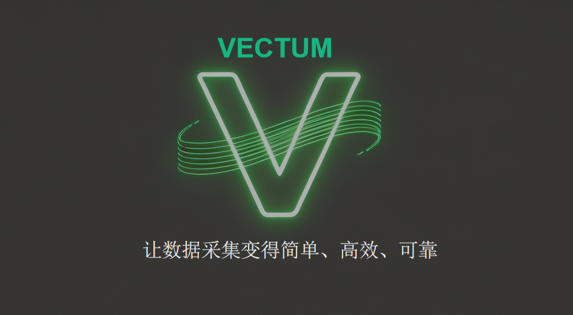
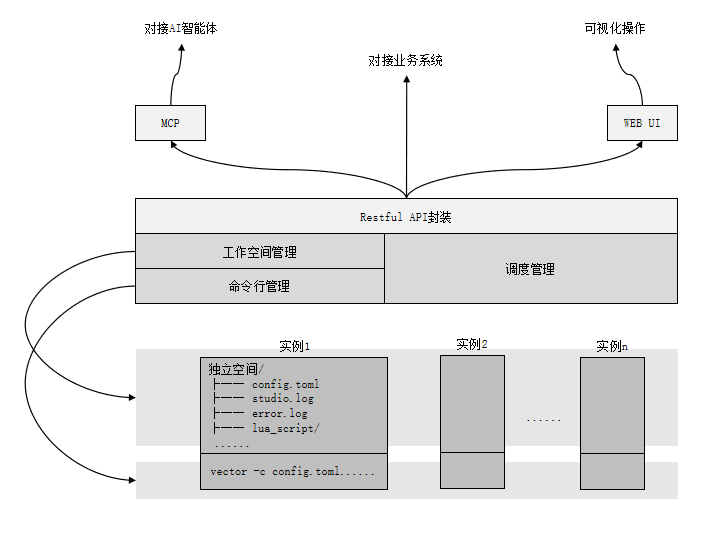

# Vectum — 基于 Vector 的可视化数据管道管理工具



**Vectum** 是一款基于 **Vector** 封装的轻量级数据管道管理工具，面向运维/DevOps 团队，提供**可视化界面 + RESTful API + MCP 协议**三位一体能力，用于统一管理、调度、监控多实例 Vector 数据采集任务，支持日志、指标、安全审计数据的全链路采集、转换与转发。

---

## 一、产品定位

Vectum = **Vector 多实例编排 + 可视化运维 + API 化管理 + MCP 智能体**

### 解决原生 Vector 的痛点

| 原生 Vector 痛点 | Vectum 解决方案 |
| :--- | :--- |
| 纯命令行操作，运维门槛高 | 提供可视化 Web UI |
| 多实例管理困难 | 进程隔离，独立管理 |
| 配置编写成本高 | AI 自动生成配置 |
| 无统一监控与日志入口 | 统一监控面板 |

---

## 二、核心能力

### 1. 多实例 Vector 管理
- 每个任务对应 **独立 Vector 进程**
- 支持并行运行任意数量采集任务
- 进程隔离、配置隔离、日志隔离

### 2. RESTful API 能力
- **任务管理**：创建、更新、删除任务配置
- **启停控制**：启动 / 停止 / 重启指定任务
- **日志查询**：实时查看任务运行日志、错误日志
- **状态监控**：获取任务运行状态、进程 PID

### 3. 可视化界面（Web UI）
- **表单创建任务**：提交一次 = 创建一个独立 Vector 进程
- **任务列表**：展示所有任务，支持启动/停止/编辑/删除
- **实时监控**：查看运行状态、进程信息、资源占用
- **日志查看**：实时流查看任务日志，支持搜索过滤

### 4. MCP 协议支持（对接 AI）
- 暴露标准 MCP 接口，支持 AI 客户端调用
- 自然语言生成 Vector 配置
- 一键部署 AI 生成的配置为任务

---

## 三、典型使用场景

| 场景 | 描述 |
| :--- | :--- |
| 服务器日志采集 | Nginx、Syslog、应用日志统一采集 |
| 云原生数据采集 | K8s 日志、指标、审计数据采集 |
| 安全日志转发 | 统一转发到 Elasticsearch、Splunk |
| 异构数据源处理 | 文件、Kafka、MySQL、Redis 统一处理 |
| AI 自动化配置 | 自然语言生成数据管道配置 |

---

## 四、系统架构



### 架构分层

#### 1. 底层：实例运行层
- 每个实例拥有独立文件隔离空间（配置、日志、脚本）
- 通过命令行指令启动，支持多实例并行运行

#### 2. 中间层：平台核心管理层
| 模块 | 核心能力 |
| :--- | :--- |
| 工作空间管理 | 实例独立空间生命周期管理 |
| 命令行管理 | 封装底层命令行操作 |
| 调度管理 | 任务调度、资源分配、状态监控 |
| RESTful API 封装 | 标准化 HTTP 接口 |

#### 3. 上层：接入层
- **业务系统对接**：通过 API 集成
- **AI 智能体对接**：通过 MCP 协议
- **可视化操作**：Web UI 界面

---

## 五、快速上手

### 1. 技术栈

| 分类 | 技术 | 版本 |
| :--- | :--- | :--- |
| 语言 | Java | 17 |
| 框架 | Spring Boot | 3.2.0 |
| 数据管道 | Vector | 0.35+ |
| API 文档 | Springfox Swagger | 3.0.0 |
| 代码混淆 | ProGuard | 7.2.1 |

### 2. 环境要求

- JDK 17+
- Maven 3.8+
- Vector 0.35+（已内置在 `vector/` 目录）

### 3. 启动方式

#### 开发态运行

```bash
# 进入项目目录
cd data-service

# 编译项目
mvn clean compile

# 运行项目
mvn spring-boot:run
```

#### 打包构建

```bash
# 打包（包含代码混淆）
mvn clean package

# 运行打包后的 Jar
java -jar target/application.jar
```

#### Docker 启动

```bash
# 构建镜像
docker build -t vectum:latest .

# 运行容器
docker run -d -p 8080:11002 -v /path/to/vector:/vector vectum:latest
```

### 4. 服务访问

| 服务 | 地址 |
| :--- | :--- |
| API 服务 | `http://<ip>:11002` |
| Swagger 文档 | `http://<ip>:11002/swagger-ui.html` |
| MCP 接口 | `http://<ip>:11002/mcp` |

---

## 六、配置说明

### 配置文件

`src/main/resources/application.properties`

### 主要配置项

| 配置项 | 默认值 | 说明 |
| :--- | :--- | :--- |
| `server.port` | `11002` | 服务端口 |
| `vector.home` | `/vector/` | Vector 安装目录 |
| `task.file` | `/tasks.json` | 任务数据存储文件 |
| `spring.task.execution.pool.core-size` | `10` | 异步线程池核心大小 |
| `spring.task.execution.pool.max-size` | `20` | 异步线程池最大大小 |

### Vector 配置说明

每个任务的配置支持 **YAML、TOML、JSON** 三种格式，系统会自动识别格式类型：

**TOML 格式示例：**
```toml
[sources]
nginx = { type = "file", path = "/var/log/nginx/access.log" }

[sinks]
elasticsearch = { type = "elasticsearch", endpoints = ["http://es:9200"], index = "logs-%Y-%m-%d" }
```

**YAML 格式示例：**
```yaml
sources:
  nginx:
    type: "file"
    path: "/var/log/nginx/access.log"

sinks:
  elasticsearch:
    type: "elasticsearch"
    endpoints:
      - "http://es:9200"
    index: "logs-%Y-%m-%d"
```

**JSON 格式示例：**
```json
{
  "sources": {
    "nginx": {
      "type": "file",
      "path": "/var/log/nginx/access.log"
    }
  },
  "sinks": {
    "elasticsearch": {
      "type": "elasticsearch",
      "endpoints": ["http://es:9200"],
      "index": "logs-%Y-%m-%d"
    }
  }
}
```

---

## 七、项目结构

```
data-service/
├── src/main/java/com/coolxer/
│   ├── Application.java           # 启动类
│   ├── controller/                # REST API 控制器
│   │   └── TaskController.java    # 任务管理接口
│   ├── service/                   # 业务服务层
│   │   ├── TaskService.java       # 任务服务接口
│   │   ├── VectorService.java     # Vector 进程管理接口
│   │   ├── MonitorService.java    # 日志监控接口
│   │   └── impl/                  # 服务实现类
│   ├── model/                     # 数据模型
│   │   ├── Task.java              # 任务实体
│   │   ├── TaskDto.java           # 任务传输对象
│   │   ├── TaskVo.java            # 任务视图对象
│   │   └── LuaFile.java           # Lua 文件模型
│   ├── dao/                       # 数据访问层
│   │   ├── TaskRepository.java    # 任务数据访问
│   │   └── TaskRepositoryImpl.java
│   ├── config/                    # 配置类
│   │   └── AsyncConfig.java       # 异步线程池配置
│   ├── commons/                   # 公共组件
│   │   ├── enums/                 # 枚举类
│   │   └── exception/             # 异常处理
│   ├── component/                 # Spring 组件
│   │   └── StartRunnerComponent.java
│   └── utils/                     # 工具类
│       └── FileUtil.java
├── src/main/resources/
│   ├── application.properties     # 应用配置
│   └── logback.xml                # 日志配置
├── vector/                        # Vector 引擎目录
│   ├── bin/vector                 # Vector 二进制文件
│   └── config/                    # Vector 配置示例
├── bin/                           # 编译输出目录
├── doc/                           # 文档资源
│   ├── architecture.png           # 架构图
│   └── slogan.png                 # 图标
├── pom.xml                        # Maven 依赖
├── proguard.cfg                   # ProGuard 配置
├── Dockerfile                     # Docker 配置
└── README.md                      # 项目文档
```

---

## 八、API 接口文档

### 基础路径

所有 API 接口前缀：`/vectum/api/v1/task`

### 接口列表

| HTTP 方法 | 路径 | 功能 | 参数 |
| :--- | :--- | :--- | :--- |
| POST | `/add` | 创建任务 | `TaskDto` JSON 对象 |
| PUT | `/{id}` | 更新任务 | `id`, `TaskDto` |
| DELETE | `/{id}` | 删除任务 | `id` (路径参数) |
| DELETE | `/batch` | 批量删除任务 | `ids` (逗号分隔) |
| GET | `/all` | 查询所有任务 | 无 |
| GET | `/{id}/view` | 查询任务详情 | `id` (路径参数) |
| POST | `/{id}/toggle` | 启动/停止任务 | `id` (路径参数) |
| GET | `/{id}/log` | 获取任务日志 | `id`, `log_type` |

### 请求示例

**创建任务**

```bash
POST /vectum/api/v1/task/add
Content-Type: application/json

{
  "name": "nginx-log",
  "description": "采集 Nginx 访问日志",
  "config": "[sources]\n  nginx = { type = \"file\", path = \"/var/log/nginx/access.log\" }"
}
```

**响应示例**

```json
{
  "code": 0,
  "message": "success",
  "data": {
    "id": 1,
    "name": "nginx-log",
    "description": "采集 Nginx 访问日志",
    "status": "created",
    "pid": 0
  }
}
```

**启动任务**

```bash
POST /vectum/api/v1/task/1/toggle
```

**获取日志**

```bash
GET /vectum/api/v1/task/1/log?log_type=console
```

### 响应格式

| 字段 | 类型 | 说明 |
| :--- | :--- | :--- |
| `code` | int | 状态码 (0=成功, 其他=失败) |
| `message` | string | 响应消息 |
| `data` | object | 响应数据 |

---

## 九、使用指南

### 创建数据采集任务

1. 通过 API 或 Web UI 创建任务
2. 提供任务名称和 Vector TOML 配置
3. 系统自动创建工作空间并生成配置文件
4. 调用启动接口启动任务

### 监控任务状态

- 通过 `/all` 接口查看所有任务状态
- 通过 `/{id}/view` 查看单个任务详情
- 通过 `/{id}/log` 获取任务运行日志

### 停止/删除任务

- `/{id}/toggle` 切换任务运行状态
- `/{id}` DELETE 删除任务（会先停止进程）

---

## 十、MCP + AI 使用指南

### 自然语言配置生成

在 Web UI 输入自然语言指令：

> "采集 /var/log/secure 日志，输出到 Elasticsearch，按天分索引"

系统自动执行：
1. 调用 MCP → AI 分析需求
2. 生成合法 `vector.toml` 配置
3. 自动创建并启动任务

### MCP 接口端点

```
POST /mcp/chat
Content-Type: application/json

{
  "message": "帮我创建一个采集 Nginx 日志的任务"
}
```

---

## 十一、优势

| 特性 | 说明 |
| :--- | :--- |
| 轻量无依赖 | 底层 Vector 单二进制，无复杂依赖 |
| 一键部署 | Docker / 二进制均可快速部署 |
| 多实例隔离 | 任务之间互不影响，稳定性高 |
| 全栈可视化 | 无需懂 Vector 配置也能使用 |
| AI 驱动 | 自然语言生成配置，零门槛 |
| 企业级 API | 可深度集成到业务系统 |

---

## 十二、适用人群

- 运维工程师
- DevOps 工程师
- 数据平台团队
- 需要统一日志采集的业务团队

---

## 十三、贡献指南

欢迎提交 Issue 和 Pull Request！

### 开发流程

1. Fork 本仓库
2. 创建特性分支：`git checkout -b feature/xxx`
3. 提交更改：`git commit -m 'Add xxx'`
4. 推送到分支：`git push origin feature/xxx`
5. 创建 Pull Request

### 代码规范

- 遵循 Java 代码规范
- 使用 Lombok 简化代码
- 添加必要的注释和文档
- 确保测试覆盖核心功能

---

## 十四、许可证

Apache 2.0 License

---

## 十五、联系方式

如有问题或建议，欢迎通过以下方式联系：

- 提交 Issue
- 发送邮件：<coolxer@163.com>

---

**Vectum** — 让数据管道管理更简单